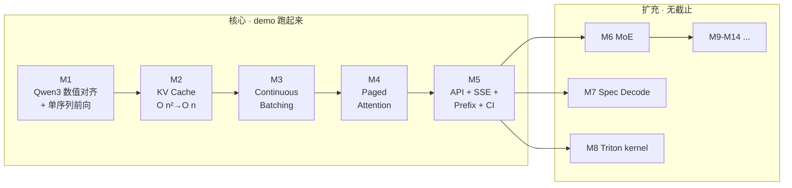

<div align="center">

# inferlite

**从零手写一个可读、可跑、可解释的 LLM 推理引擎**

覆盖 vLLM 核心思想 — KV cache · PagedAttention · Continuous Batching · Prefix Cache —
按里程碑驱动持续扩充（MoE / Spec Decoding / Triton / VLM …）

[](https://luhao2013.github.io/inferlite/)
[](https://github.com/luhao2013/inferlite/actions/workflows/tests.yml)
[](LICENSE)
[](https://www.python.org/downloads/)
[](https://github.com/astral-sh/uv)

[**🌐 在线文档站**](https://luhao2013.github.io/inferlite/)  ·  [路线图](docs/1-plan/PLAN.md)  ·  [实时进度](docs/1-plan/PROGRESS.md)  ·  [当前作战 M1](docs/1-plan/M1.md)

</div>

---

## 项目定位

| 不变量 | 说明 |
| --- | --- |
| **代码全手敲** | 作者本人手写每一行 `inferlite/*.py`；Agent 仅辅助研究 / 计划 / Review / 文章 |
| **里程碑闭环** | 每个 M 完成 = ① 代码 push  ② 知乎文章发布  ③ PROGRESS 更新 |
| **学习 > 性能** | 优先可读性；性能优化作为后续里程碑慢慢加 |
| **Spec-driven** | 任务卡 7 字段（前置/边界/验收/风险/完成总结），见 [ADR-001](docs/3-kb/decisions.md) |

## 30 秒 Quick Start

```bash
git clone git@github.com:luhao2013/inferlite.git
cd inferlite
make setup            # uv 装环境 + sanity check
make test             # 跑 12/12 单测，全绿
make preflight        # 一键拉 Qwen3-0.6B + 端到端跑一句话
```

更多命令见 [`make help`](docs/4-setup.md#2-常用命令) 或 `docs/4-setup.md`。

## 路线图



完整 14 个里程碑见 [`docs/1-plan/PLAN.md`](docs/1-plan/PLAN.md)。

## 当前进度

- ✅ **M0** 仓库 + 计划 + 知识库脚手架
- 🟡 **M1** Qwen3 数值对齐 + 单序列前向
  - ✅ T0 ModelConfig（5/5 单测）
  - ✅ T1 RMSNorm（12/12 单测）
  - ✅ T2 SwiGLU（10/10 单测）
  - ✅ T3 RoPE（12/12 单测）
  - ⬜ T4 Attention · T5 Block · T6 LM Head
- ⬜ M2 KV Cache · M3 Continuous Batching · M4 PagedAttention · M5 API+SSE
- ⬜ M6+ MoE / Spec Decoding / Triton / VLM …

实时状态见 [`docs/1-plan/PROGRESS.md`](docs/1-plan/PROGRESS.md)。

## 文档导航

| 入口 | 内容 |
| --- | --- |
| 🌐 [**在线文档站**](https://luhao2013.github.io/inferlite/) | 极客风深色主题 · 全文搜索 · mermaid 渲染 |
| 🗺️ [`docs/1-plan/`](docs/1-plan/) | PLAN（14 个 M）· PROGRESS · 当前作战 M1 |
| 📋 [`docs/2-tasks/`](docs/2-tasks/) | 任务卡（一卡一文件，七字段闭环） |
| 📚 [`docs/3-kb/`](docs/3-kb/) | knowledge / lessons / decisions / references |
| ⚙️ [`docs/4-setup.md`](docs/4-setup.md) | 环境 + 仓库结构速查 |
| 🤖 [`CLAUDE.md`](CLAUDE.md) | AI 协作约定（双轨制 · spec-driven） |

## 技术栈

- **Python** 3.12 + **PyTorch** 2.4+（当前 lock：2.12.0）
- **主模型**：Qwen3-0.6B（M1–M5 起步） · 通过 ModelScope 拉
- **Tokenizer**：复用 `transformers.AutoTokenizer`
- **数值对齐基准**：当前 `uv.lock` 锁定的 `transformers==5.10.2`
- **Server**：FastAPI + SSE（M5 引入）
- **硬件**：Mac MPS 主开发（M1–M7） · GPU 在 M5 benchmark / M8 Triton 必需
- **工具链**：uv · ruff · pytest · pre-commit · MkDocs Material

## 工作流（spec-driven · 5 个 slash commands）

```text
/plan <scope>      规划（M / T / 调整），含前置调研
/work <task>       开任务卡，含 knowledge gap 检查
/review <task>     review 已完成任务卡
/archive <id>      归档（沉淀 lessons + knowledge + summary）
/preflight         环境健康检查
```

详见 [`docs/3-kb/decisions.md`](docs/3-kb/decisions.md) ADR-001。

## License

MIT — 见 [LICENSE](LICENSE)。

---

<div align="center">
<sub>Built with ❤ + uv + PyTorch · Powered by <a href="https://luhao2013.github.io/inferlite/">MkDocs Material</a></sub>
</div>
