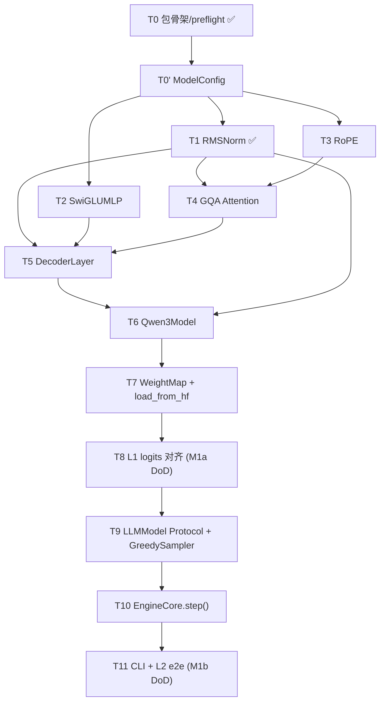

# M1 Brief — Qwen3-0.6B 单序列推理

> **一句话目标**：手写一个最小但完整的 LLM 推理框架，能在 Mac MPS 上跑通 `python -m inferlite.cli "你好"` 并产出与 transformers 完全一致的输出。
>
> **拆分**：M1a 数值对齐（L0+L1） → M1b 出字闭环（L2+L3）
>
> **文档定位**：这是 M1 的"作战地图"。先读 §2 架构图，再看 §3 任务表，按 §4 顺序推进。

---

## 1. DoD（完成定义）

### M1a — Qwen3 数值对齐
1. T1–T8 八张任务卡全部 ✅
2. L0 单测全绿（每个手写模块都有 vs transformers 的 allclose）
3. L1 整模型 logits vs `transformers==5.10.2`：`allclose(atol=1e-3, rtol=1e-3)`
4. **不做**：CLI、Engine、KV cache、Scheduler、文章

### M1b — 单序列出字
1. T9–T11 三张任务卡全部 ✅
2. `python -m inferlite.cli "你好" --max-new-tokens 32` 稳定吐出连贯文本
3. L2 e2e：固定 seed，前 16 token 与 HF `model.generate(do_sample=False)` 完全一致
4. L3 invariant：`EngineCore.step()` 必走 `schedule→execute→postprocess` 三段
5. 知乎文章草稿《手写 LLM 推理引擎 1：先让模型出字》初稿
6. Tag `v0.1`，PROGRESS.md 更新

**显式不做**（M2+）：KV cache、batching、PagedAttention、采样多策略、benchmark。

---

## 2. Qwen3-0.6B 架构总览

### 2.1 整体数据流

```
                input_ids                       [B, T]           int64
                    │
                    ▼
            ┌─────────────────┐
            │  embed_tokens   │  [V=151936, H=1024]   T7 加载
            └─────────────────┘
                    │
                    ▼                            [B, T, H=1024]
       ┌───────────────────────────────────────────────────────┐
       │                                                       │
       │   ┌──── × N=28 层 (Qwen3DecoderLayer) ──────────┐    │
       │   │                                              │    │
       │   │     residual ────────────────┐               │    │
       │   │         │                    │               │    │
       │   │  input_layernorm  ─── T1 RMSNorm             │    │
       │   │         │                    │               │    │
       │   │  self_attn  ─── T4 GQA + QK-norm + RoPE(T3)  │    │
       │   │         │                    │               │    │
       │   │         ◀────── residual add ┘               │    │
       │   │         │                                    │    │
       │   │     residual ────────────────┐               │    │
       │   │         │                    │               │    │
       │   │  post_attention_layernorm ── T1 RMSNorm      │    │
       │   │         │                    │               │    │
       │   │  mlp  ────── T2 SwiGLUMLP    │               │    │
       │   │         │                    │               │    │
       │   │         ◀────── residual add ┘               │    │
       │   │                                              │    │
       │   └──────────────────────────────────────────────┘    │
       │                                                       │
       │   ↑ 这一整块就是 T5 Qwen3DecoderLayer                  │
       │                                                       │
       │   最外层串 28 层 + 末端 norm + lm_head = T6 Qwen3Model │
       │                                                       │
       └───────────────────────────────────────────────────────┘
                    │                            [B, T, H]
                    ▼
            ┌─────────────────┐
            │  norm (RMSNorm) │   T1 复用
            └─────────────────┘
                    │                            [B, T, H]
                    ▼
            ┌─────────────────┐
            │     lm_head     │   tie_word_embeddings=True
            │  = embed_tokens │   ↑ 共享权重，T7 处理
            │       .T        │
            └─────────────────┘
                    │
                    ▼
                  logits                         [B, T, V=151936]
```

### 2.2 关键超参（写 `ModelConfig` 直接抄）

| 字段 | 值 | 含义 |
| --- | --- | --- |
| `hidden_size` (H) | 1024 | 每个 token 的隐藏向量维度 |
| `num_hidden_layers` (N) | 28 | DecoderLayer 数量 |
| `num_attention_heads` | 16 | Query 头数 |
| `num_key_value_heads` | 8 | Key/Value 头数（GQA 16:8 → 每 2 个 Q 共享 1 个 KV） |
| `head_dim` | 128 | hidden_size / num_attention_heads |
| `intermediate_size` (I) | 3072 | SwiGLU 中间维度（≈3×H） |
| `vocab_size` (V) | 151936 | 词表大小 |
| `max_position_embeddings` | 40960 | 原生上下文长度 |
| `rope_theta` | 1e6 | RoPE 基频 |
| `rms_norm_eps` | 1e-6 | RMSNorm ε（注意：不是 LLaMA 的 1e-5） |
| `tie_word_embeddings` | true | lm_head 与 embed_tokens 共享权重 |

### 2.3 vs LLaMA / Qwen2 的差异（容易踩坑）

| 特性 | LLaMA | Qwen2 | **Qwen3-0.6B** |
| --- | --- | --- | --- |
| RMSNorm eps | 1e-5 | 1e-6 | **1e-6** |
| MLP | SwiGLU | SwiGLU | SwiGLU（同） |
| Attention | MHA / GQA | GQA | **GQA + QK-norm**（多一次 RMSNorm） |
| RoPE base θ | 1e4 | 1e6 | 1e6（同 Qwen2） |
| tie_embedding | 视模型 | 视模型 | **true**（0.6B 共享，>0.6B 不共享） |
| lm_head bias | 无 | 无 | 无 |
| QKV bias | 视模型 | **有** | **无**（Qwen3 改了） |

---

## 3. 模块清单与任务 DAG

### 3.1 要手写的 10 个模块（不含测试）

| 模块 | 文件位置 | 任务卡 | 行数估计 | 数学/工程含量 |
| --- | --- | --- | --- | --- |
| `ModelConfig` | `inferlite/config.py` | T0' | ~30 | 工程 |
| `RMSNorm` | `inferlite/model/layers.py` | **T1 ✅** | ~15 | 数学 |
| `SwiGLUMLP` | `inferlite/model/layers.py` | T2 | ~15 | 数学 |
| `RotaryEmbedding` + `apply_rotary` | `inferlite/model/layers.py` | T3 | ~40 | **数学★** |
| `GQAAttention`（QK-norm + RoPE + SDPA） | `inferlite/model/layers.py` | T4 | ~60 | 数学+工程 |
| `Qwen3DecoderLayer` | `inferlite/model/qwen3.py` | T5 | ~25 | 工程 |
| `Qwen3Model`（整模型拼装） | `inferlite/model/qwen3.py` | T6 | ~50 | 工程 |
| `WeightMap` + `load_from_hf` | `inferlite/model/weight_map.py` + `loader.py` | T7 | ~80 | 工程★ |
| `GreedySampler` | `inferlite/sampler/greedy.py` | T9' | ~15 | 工程 |
| `EngineCore.step()` + `CLI` | `inferlite/engine/core.py` + `inferlite/cli.py` | T10 + T11 | ~100 | 工程 |

总计：**约 430 行实现 + 200 行测试 + Protocol 占位**，符合 PLAN 1500 行目标。

### 3.2 任务依赖图



**可并行**：T1 / T2 / T3 三张卡互相独立（前置都是 T0'），M1a 实际推进时可以两线开。

---

## 4. 任务卡总表（M1a）

> **每张卡的完整 7 字段（前置/产出/算法核心/L0测试/DoD/坑/估时）** 在 `docs/tasks/M1-TX-*.md` 独立文件中维护。
> 这里只列索引与状态。索引文件：[docs/tasks/README.md](./tasks/README.md)。

| # | 名称 | 状态 | 任务卡详情 | 估时 |
| --- | --- | --- | --- | --- |
| T0 | 包骨架 + preflight | ✅ | （历史，并入 M0） | — |
| T0' | ModelConfig dataclass | ⬜ | [M1-T0p-ModelConfig.md](./tasks/M1-T0p-ModelConfig.md) | 20m |
| **T1** | **RMSNorm** | **✅** | [M1-T1-RMSNorm.md](./tasks/M1-T1-RMSNorm.md) | 已完成 |
| T2 | SwiGLU MLP | ⬜ | [M1-T2-SwiGLU.md](./tasks/M1-T2-SwiGLU.md) | 1h |
| T3 | RoPE | ⬜ | 开工时创建 | 2h |
| T4 | GQA Attention | ⬜ | 开工时创建 | 3h |
| T5 | DecoderLayer | ⬜ | 开工时创建 | 1h |
| T6 | Qwen3Model | ⬜ | 开工时创建 | 2h |
| T7 | WeightMap + load_from_hf | ⬜ | 开工时创建 | 3h |
| **T8** | **L1 logits 对齐** | ⬜ | 开工时创建 | 2h |

### 任务卡总表（M1b）

| # | 名称 | 状态 | 任务卡详情 | 估时 |
| --- | --- | --- | --- | --- |
| T9 | LLMModel Protocol + GreedySampler | ⬜ | 开工时创建 | 1h |
| T10 | EngineCore.step() 三段式 | ⬜ | 开工时创建 | 3h |
| T11 | CLI + L2 e2e | ⬜ | 开工时创建 | 2h |

---

## 5. 模型加载策略（T7 提前讲清楚）

T7 是 M1a 最容易卡住的一张卡，权重映射做错整模型就崩。这里把"权重哪来 → 怎么读 → 怎么映射 → 共享权重怎么处理"一次说清。

### 5.1 权重物理位置

ModelScope 下载后默认缓存在：

```
~/.cache/modelscope/hub/models/Qwen/Qwen3-0___6B/
├── config.json                  ← 模型超参，对应 ModelConfig
├── tokenizer.json
├── tokenizer_config.json
├── model.safetensors            ← 唯一一个权重文件（0.6B 不分片）
└── ...
```

> Qwen3-0.6B 总共约 1.2 GB（fp16）/ 2.4 GB（fp32），单个 safetensors 文件即可装下，**不分片**。

### 5.2 HF 命名 vs inferlite 自家命名

HF safetensors 里的 key 形如：

```
model.embed_tokens.weight                                       → embed
model.layers.0.input_layernorm.weight                           → 第 0 层 norm1.weight
model.layers.0.self_attn.q_proj.weight                          → 第 0 层 attn.q_proj.weight
model.layers.0.self_attn.k_proj.weight
model.layers.0.self_attn.v_proj.weight
model.layers.0.self_attn.o_proj.weight
model.layers.0.self_attn.q_norm.weight                          ← Qwen3 特有（QK-norm）
model.layers.0.self_attn.k_norm.weight                          ← Qwen3 特有
model.layers.0.post_attention_layernorm.weight                  → norm2.weight
model.layers.0.mlp.gate_proj.weight
model.layers.0.mlp.up_proj.weight
model.layers.0.mlp.down_proj.weight
...
model.layers.27.<同上>
model.norm.weight                                               → 末端 norm.weight
# 注意：lm_head.weight 不存在 → tie_word_embeddings=True
```

inferlite 这边的命名（与 HF 几乎 1:1，省得再写翻译表）：

```python
# inferlite/model/qwen3.py
class Qwen3Model(nn.Module):
    def __init__(self, config):
        self.embed_tokens = nn.Embedding(V, H)
        self.layers = nn.ModuleList([Qwen3DecoderLayer(config) for _ in range(N)])
        self.norm = RMSNorm(H, eps=1e-6)
        # 不显式建 lm_head；forward 里用 F.linear(x, self.embed_tokens.weight)
```

### 5.3 WeightMap 的两件事

```python
# inferlite/model/weight_map.py
def hf_to_inferlite(hf_key: str) -> str:
    """HF safetensors key → inferlite state_dict key.
    Qwen3 命名几乎 1:1，去掉 'model.' 前缀即可。
    """
    if hf_key.startswith("model."):
        return hf_key[len("model."):]
    return hf_key

# inferlite/model/loader.py
def load_qwen3_from_modelscope(repo_id="Qwen/Qwen3-0.6B", dtype=torch.float32):
    from modelscope import snapshot_download
    from safetensors.torch import load_file

    local_dir = snapshot_download(repo_id)
    config = ModelConfig.from_json(f"{local_dir}/config.json")
    model = Qwen3Model(config).to(dtype)

    state_dict_hf = load_file(f"{local_dir}/model.safetensors")
    state_dict_ours = {hf_to_inferlite(k): v for k, v in state_dict_hf.items()}

    missing, unexpected = model.load_state_dict(state_dict_ours, strict=False)
    # missing 应该只有 lm_head.weight（因为 tie）；unexpected 应为空
    assert all("lm_head" in k for k in missing)
    assert not unexpected, f"unexpected keys: {unexpected}"
    return model
```

### 5.4 tie_word_embeddings 怎么处理

**核心**：HF safetensors 里压根没有 `lm_head.weight`（因为 tie=True，存重复浪费）。inferlite 也不要建 `nn.Linear(H, V)`，直接：

```python
# Qwen3Model.forward 最后一步
logits = F.linear(hidden_states, self.embed_tokens.weight)   # [B, T, V]
```

`F.linear(x, W)` 等价于 `x @ W.T`，所以 `embed_tokens.weight: [V, H]` 直接当 lm_head 用，不需要转置（PyTorch 内部已转）。

---

## 7. 测试金字塔（L0–L3）

| 层 | 跑什么 | 触发时机 | 典型规模 |
| --- | --- | --- | --- |
| **L0 单测** | 每个手写模块 vs transformers 同名函数 allclose | 每张任务卡完成时 + CI | 单算子，<1s |
| **L1 模块** | 整 `Qwen3Model` 跑一个 prompt 的 logits vs transformers | T8 验收 + CI | 全模型 forward，~5s |
| **L2 e2e** | `cli "你好"` 与 HF `generate(do_sample=False)` 前 16 token 完全一致 | T11 验收 | 端到端 ~10s |
| **L3 invariant** | `EngineCore.step()` 必走 schedule→execute→postprocess | T10 验收 + CI | 协议级，<1s |

每个层都进 CI（除了 L1 太重，可标 `@pytest.mark.slow`，nightly 跑）。

---

## 8. 易踩坑（按概率排序，写代码前过一遍）

| # | 坑 | 现象 | 防御 |
| --- | --- | --- | --- |
| 1 | RoPE 风格选错 | logits 形状对但数值偏 | 严格按 transformers `Qwen3RotaryEmbedding`（half-rotation 风格） |
| 2 | QK-norm 漏写 | Attention 测试 atol 过不去 | T4 显式有 `q_norm`/`k_norm` 两个 RMSNorm |
| 3 | GQA `repeat_kv` 顺序错 | logits 完全乱 | 用 `repeat_interleave(dim=1)` 不是 `repeat` |
| 4 | tie_word_embeddings 漏接 | load_state_dict missing key 报错 | T7 处理 `lm_head` missing，并在 forward 里用 `embed_tokens.weight` |
| 5 | QKV bias 误开 | weight load 失败 | Qwen3 是 **bias=False**（区别于 Qwen2） |
| 6 | MPS fp16 异常 | 某些算子报错 | M1 全程 fp32，M5 才上 fp16/bf16 |
| 7 | causal mask 漏传 | prompt > 1 时 logits 全错 | SDPA 调用必须 `is_causal=True` |
| 8 | RMSNorm eps 抄错 | logits 误差累积 | 用 1e-6 不是 1e-5 |
| 9 | 国内下不动 HF | Connection reset | 已默认走 ModelScope（见 lessons.md L2） |
| 10 | weight 加载到 cpu 但 forward 在 mps | runtime device mismatch | `model.to(device)` 在 load 完之后立刻调用 |

---

## 9. 推进节奏（参考）

```
M1a-Day 1   T0' ModelConfig（20m） + T2 SwiGLU（1h） + T3 RoPE（2h）
M1a-Day 2   T4 GQA Attention（3h，最难一张）
M1a-Day 3   T5 DecoderLayer（1h） + T6 Qwen3Model（2h）
M1a-Day 4   T7 WeightMap + load_from_hf（3h） + T8 L1 logits 对齐（2h）→ M1a 收官

M1b-Day 1   T9 Sampler + Protocol（1h） + T10 EngineCore（3h）
M1b-Day 2   T11 CLI + L2 e2e（2h）+ 文章草稿 → 打 v0.1 tag
```

实际推进每张卡完成立刻 commit + 更新 §3.1 状态列。

---

## 10. 启动 checklist（每张卡开始前过一遍）

- [ ] `make preflight` 当前还能跑通（地基没塌）
- [ ] 上一张依赖卡的 L0 测试全绿（防回归）
- [ ] 当前卡的 §6 详细描述已写到本文件
- [ ] transformers 对应类的源码已读一遍（找到 ground truth）
- [ ] 心里有数：哪个 case 最容易错

---

## 11. 概念与知识速查

> 概念（形状/超参/upcast/tie_embed 等）见 `docs/knowledge.md` → Concepts。
> 库 API（transformers/pytest/uv 等）见 `docs/knowledge.md` → Libraries。
> 论文（RMSNorm/SwiGLU/RoPE/GQA）见 `docs/knowledge.md` → Papers。

## 12. 参考项目与论文

> 见 [docs/REFERENCES.md](./REFERENCES.md) — 三梯队开源项目（nano-vllm / LLMs-from-scratch / transformers / vllm / ...）+ 论文清单 + 阶段-资料对照表。
> M1a 阶段重点：**rasbt/LLMs-from-scratch Qwen3 notebook** + **transformers/modeling_qwen3.py**，写每个模块前各读一次对应章节。
