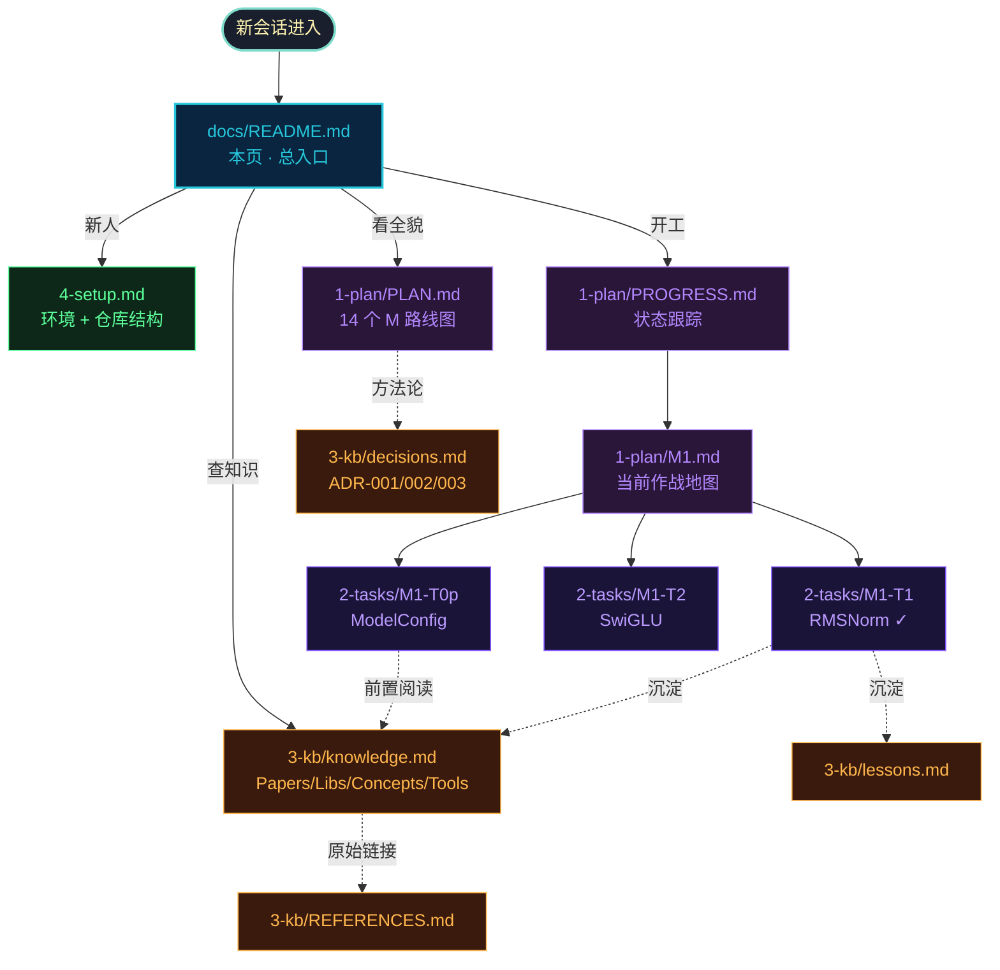

---
hide:
  - navigation
  - toc
---

<div class="geek-hero" markdown>

# inferlite

<p class="tagline">从零手撕的 LLM 推理引擎学习项目 · L0-aligned with transformers</p>

<div class="badges" markdown>


</div>

<div class="actions" markdown>

[:octicons-rocket-16: &nbsp;立即开始](./4-setup.md){ .primary }
[:octicons-graph-16: &nbsp;查看进度](./1-plan/PROGRESS.md){ .secondary }
[:fontawesome-brands-github: &nbsp;GitHub](https://github.com/luhao2013/inferlite){ .secondary }

</div>

</div>

## 文档导航

<div class="card-grid" markdown>

<a class="card" href="./1-plan/PLAN.md"><span class="icon">:octicons-milestone-16:</span><span class="title">1-plan/</span><span class="desc">14 个里程碑路线图、当前作战地图 M1、整体进度跟踪。</span><span class="meta">PLAN · PROGRESS · M&lt;n&gt;</span></a>

<a class="card" href="./2-tasks/README.md"><span class="icon">:octicons-checklist-16:</span><span class="title">2-tasks/</span><span class="desc">任务卡七字段（前置 / 边界 / 验收 / 风险 / 完成总结），一卡一文件。</span><span class="meta">M1-T0p · M1-T1 ✓ · M1-T2</span></a>

<a class="card" href="./3-kb/knowledge.md"><span class="icon">:octicons-book-16:</span><span class="title">3-kb/</span><span class="desc">知识库：论文 / 库 / 概念 / 工具 卡片化总结，踩坑教训 + ADR 决策记录。</span><span class="meta">knowledge · lessons · decisions</span></a>

<a class="card" href="./4-setup.md"><span class="icon">:octicons-tools-16:</span><span class="title">4-setup.md</span><span class="desc">一键 uv install、常用 make 命令、仓库结构速查、大坑预警。</span><span class="meta">uv · make · ruff · pytest</span></a>

</div>

## 文档关系图



## 三类文档

| 分类           | 时间维度       | 写作时机                | 文件                                                                |
| -------------- | -------------- | ----------------------- | ------------------------------------------------------------------- |
| **1-plan/**    | 未来 / 当前    | 规划 + 持续更新         | `PLAN.md` `PROGRESS.md` `M<n>.md`                                   |
| **2-tasks/**   | 当前           | 开工时写、完成时收尾    | `M<n>-T<x>-*.md`                                                    |
| **3-kb/**      | 过去（沉淀）   | 任务结束后归档          | `knowledge.md` `lessons.md` `decisions.md` `REFERENCES.md`          |
| **4-setup.md** | 长期常驻       | 项目稳定后不常变        | `4-setup.md`                                                        |

## 三条阅读路径

=== ":octicons-rocket-16: 新人 onboarding"

    1. 你正在看的 `README.md` — 知道有哪些文档
    2. [4-setup.md](./4-setup.md) — 5 分钟跑起项目
    3. [1-plan/PLAN.md](./1-plan/PLAN.md) — 看整体路线
    4. [3-kb/decisions.md](./3-kb/decisions.md) — 理解为什么这么做

=== ":octicons-checklist-16: 接任务"

    1. [1-plan/PROGRESS.md](./1-plan/PROGRESS.md) — 找下一张 :material-checkbox-blank-outline: 任务
    2. [2-tasks/](./2-tasks/README.md) 中读对应任务卡 7 字段
    3. [3-kb/knowledge.md](./3-kb/knowledge.md) — 按"前置"段查相关章节

=== ":octicons-history-16: 复盘"

    1. [3-kb/lessons.md](./3-kb/lessons.md) — 全部踩坑
    2. 当前 `M<n>.md` 末尾 Summary
    3. 任务卡末尾"完成总结"段

## 本地预览

<div class="termy" markdown>

```bash
$ make docs-serve              # http://localhost:8000
$ make docs-build              # → site/
$ make docs-deploy             # gh-pages
```

</div>

---

!!! tip "AI 协作"
    本仓库使用 spec-driven workflow，AI 协作约定见仓库根 `CLAUDE.md`。
    新会话进入前建议先 `search_memory("inferlite")`。
